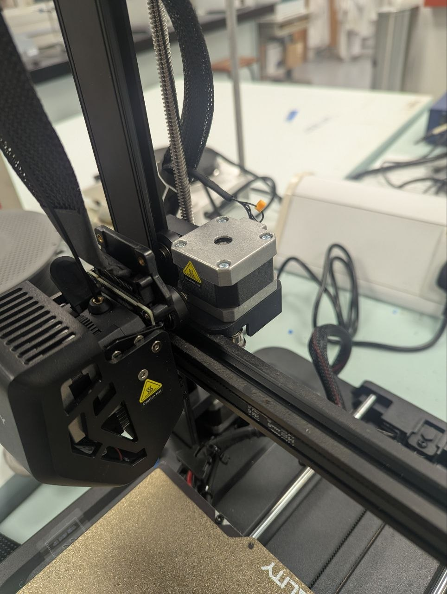

#Choosing the right printer

Our machine was developed based off the [Creality Ender-3 S1](https://www.creality.com/products/creality-ender-3-s1-3d-printer).
    

For your convenience and ease of development, we would suggest you purchase this printer or the [Creality Ender-3 S1 Pro](https://www.creality.com/products/creality-ender-3-s1-pro-fdm-3d-printer). While Creality has listed these as out of stock, we have been able to find a few models selling off third-party sites.

If you do not have access to these models, and are looking for others, we would highly recommend getting a printer that runs Marlin, and does not have it's x-axis motor on the inside of the frame as it would severely restrict the workspace of the handler without significant modification to your parts.

*Figure 1: Example of internal x-axis motor placement restricting workspace.*

*Figure 2: Preferred external layout maximizing clear movement area.*

Additionally, do make sure that your 3D printer mainboard has port for connecting a external z-limit switch. 