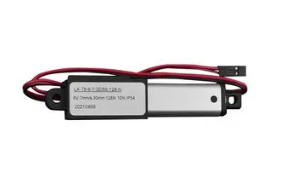
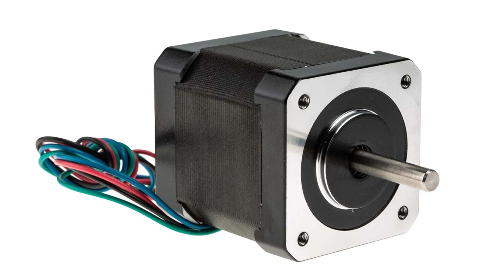
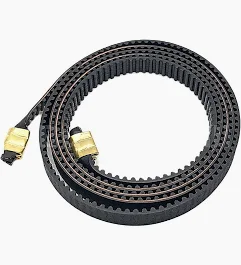
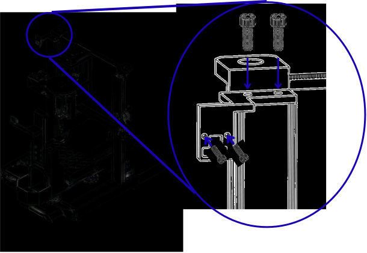
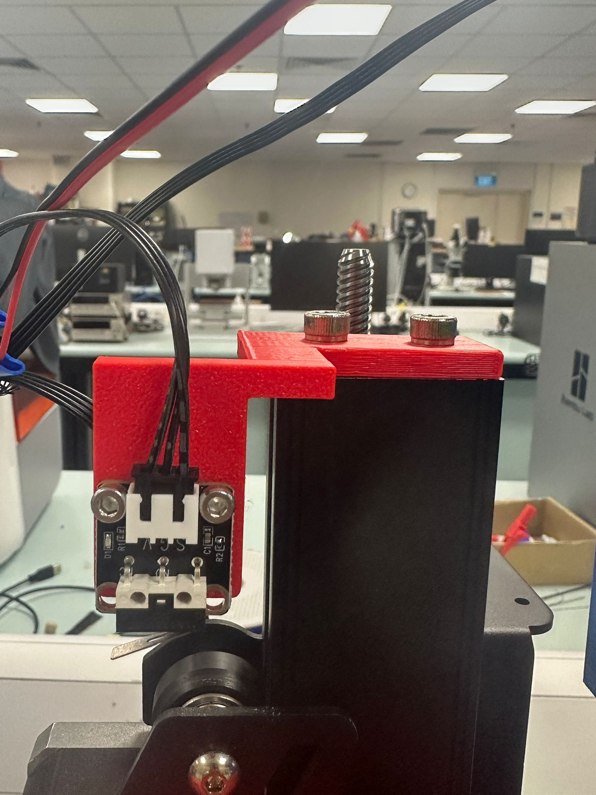
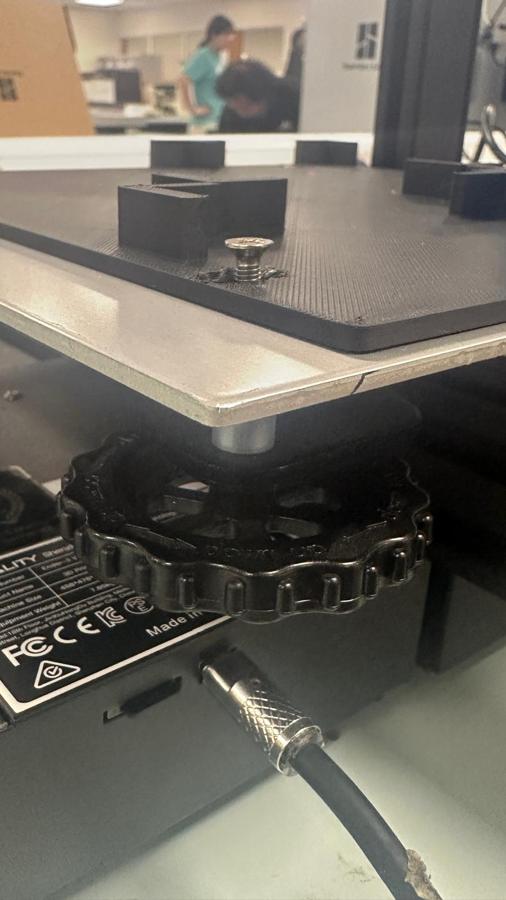
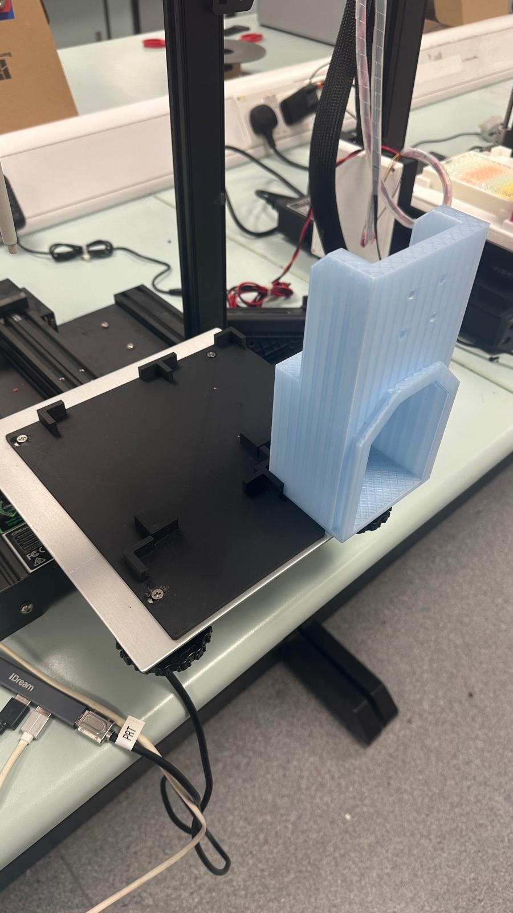
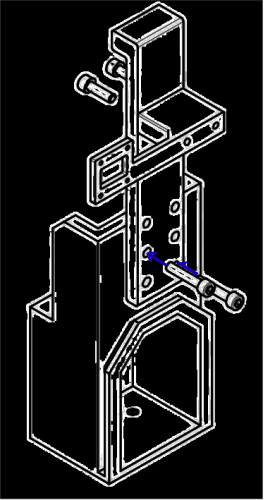
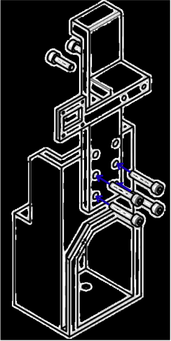
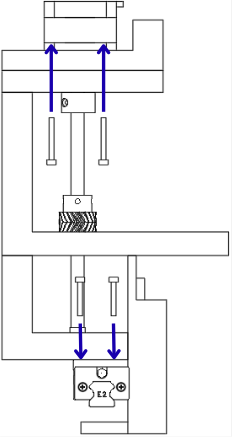

# Hardware Assembly Guide

## Overview
This page contains instructions for the hardware assembly of the Automated Liquid Handler. Please refer to the [3D printing files](https://github.com/selfdrivinglabsntu/SelfDrivingLab/tree/main/Hardware) and the [Bill of Materials](bill_of_materials.md) for the relevant parts. 

##Parts List

Gather all items.

3D Printed Parts
{: .flow-subtitle }

Tip Holder
{: .flow-grid-title }

[more options]()

Bed Plate
{: .flow-grid-title }

Tip Disposal
{: .flow-grid-title }

Tip Ejector
{: .flow-grid-title }

Tip Catcher
{: .flow-grid-title }

Camera Mount
{: .flow-grid-title }

96 Well Plate Holder
{: .flow-grid-title }

Sample Holder
{: .flow-grid-title }

Frame
{: .flow-grid-title }

Frame Linear Actuator Mount
{: .flow-grid-title }

Pipette Bracket
{: .flow-grid-title }

Z-limit switch mount
{: .flow-grid-title }

Components
{: .flow-subtitle }

Linear Actuator
{: .flow-grid-title }

Stepper Motor
{: .flow-grid-title }

Linear Rail
{: .flow-grid-title }

Belt
{: .flow-grid-title }

{.img-xxs}

Assembled PCB Board
{: .flow-grid-title }

{.img-xxs}

Mechanical Fastners
{: .flow-subtitle }

M2x20mm x10  
M3x20   x20

Head Cap Screws

##3D-Printer Assembly 

Assembling Ender 3 S1
{: .flow-title }

Follow the Creality User Manual Instructions, but:

- Skip nozzle assembly and wire clamp installation
    - Dismantle the nozzle assembly and keep the **extruder sprite board** (Figure 1) aside 
- Install the Gantry Frame
- Do not install the filament spool holder and filament sensor

OR

Modifying Existing Ender 3 S1
{: .flow-title }

Dismantle your 3D printer as follow:

- Remove the nozzle assembly and wire clamp 
    - Dismantle the nozzle assembly and keep the **extruder sprite board** (Figure 1) aside 
- Remove filament spool holder and filament sensor

 

{.img-sm}

Figure 1: Ender 3 S1 Extruer Sprite Board

##**Installation of z-limit switch**

You will need
{: .flow-grid-title }

{.img-icon}

{.img-icon}

{.img-icon}

**Why we need a z-limit switch?**  
Traditionally, z-homing on the Ender 3 S1 is performed using a BL Touch sensor. This sensor operates strictly in the downward direction, meaning the Z = 0 reference point is only established when the probe physically contacts the print bed. This is not suitable for the purpose of our project as the bed plate is occupied by liquid handling appratus such as the well plates, sample solution holders, tip holder and the tip ejection module. These obstructions will prevent homing in downwards direction. Thus, a limit switch is installed on the top of the printer frame to perform z-homing upwards i.e. when the gantry moves upwards and hits the limit switch the Z_Max is recorded. 

**Installation steps**  
Remove the bottom casing of the printer. 

{.img-md}

Figure 2: Unscrew bottom casing of the 3D printer.

Plug the z-limit switch into port J713 as shown in Figure 3A.  

Figure 3: Left - Diagramatic representation and description of mainboard interfaces and connections, Right - Photograph of mainboard with z-limit switch pugged in

>**Important:** Note down the version of the chip on the mainboard for your printer as it will be needed when compiling the custom [Marlin Firmware](../software/firmware.md). 

**Mounting the z-limit switch**  
The z-limit switch was mounted as shown in Figure 3.

{.center}

Figure 4: Left - location for mounting z-limit switch. Right - Close-up of the Z-limit switch installation The switch secures to the mount with two M3 x 6 mm screws; the mount fastens to the 3D printer's aluminium extrusion using two M5 x 10mm screws.

{.center .img-sm}

Figure : Photograph of z-limit switch installed.

##**Installation of the tip disposal and the 3D printed bed plate**

The tip disposal and the 3D printer bed plate are fixed onto the aluminium heat bed of the printer using the screws of the manual leveling knobs. 

**Removing the magnetic base** 

You will need
{: .flow-grid-title }

{.img-icon} 

{.img-icon}

{.img-icon}

The magnetic base is stuck onto the aluminium heat bed using a very strong adhesive. We suggest using strong pliers to rip off the magnetic base and an extra pair of hands to hold down the 3D printer while the other person removes the magnetic base.

Figure 5: Magnetic base removal. (A) Photograph of magnetic base. (B) Magnetic base being removed.

**Installing Bed Plate and Tip Disposal Module**  
You will notice that there already exist 4 screws that connect the manual levelling knobs to the aluminium bed. We will make use of these screws to fix our bed plate and tip disposal onto the aluminium bed.

{.center}

Figure 6: Screw in bed plate and tip disposal. Replace springs with stand offs.

{.img-sm} 

{.img-sm}  

##**Installation of Tip Ejector and Camera Mount**

You will need
{: .flow-grid-title }

{.img-icon} 

{.img-icon}

{.img-icon}

{.img-sm}

{.img-sm}

##**Installation of Frame**

You will need
{: .flow-grid-title }

{.img-icon} 

{.img-icon}

{.img-icon}

{.img-sm}

Add images

