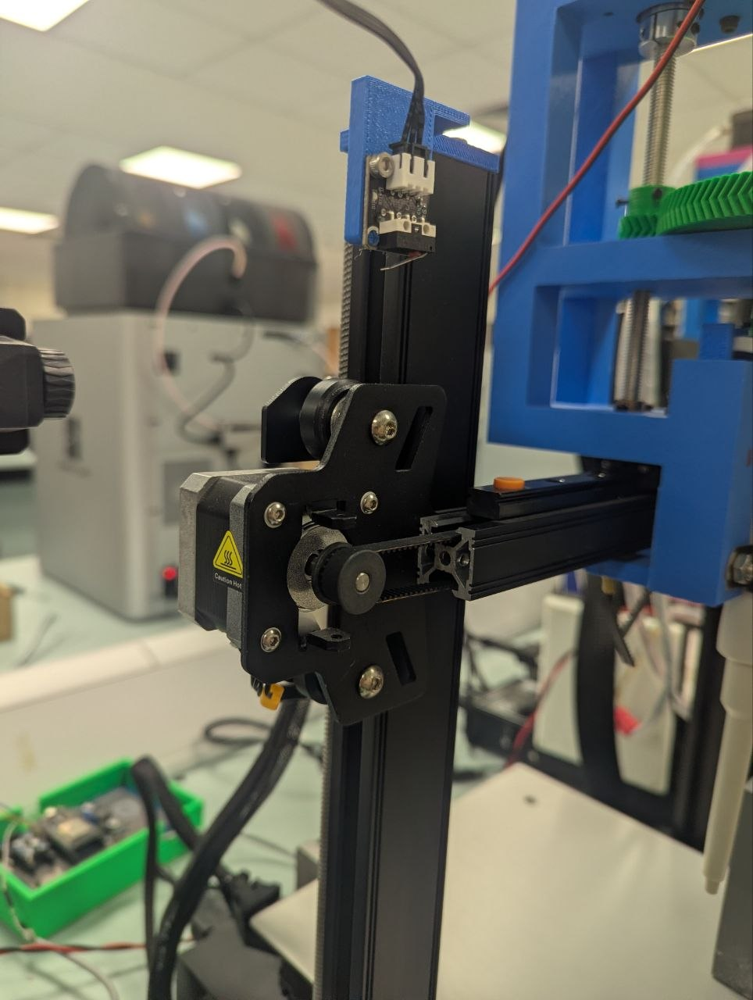
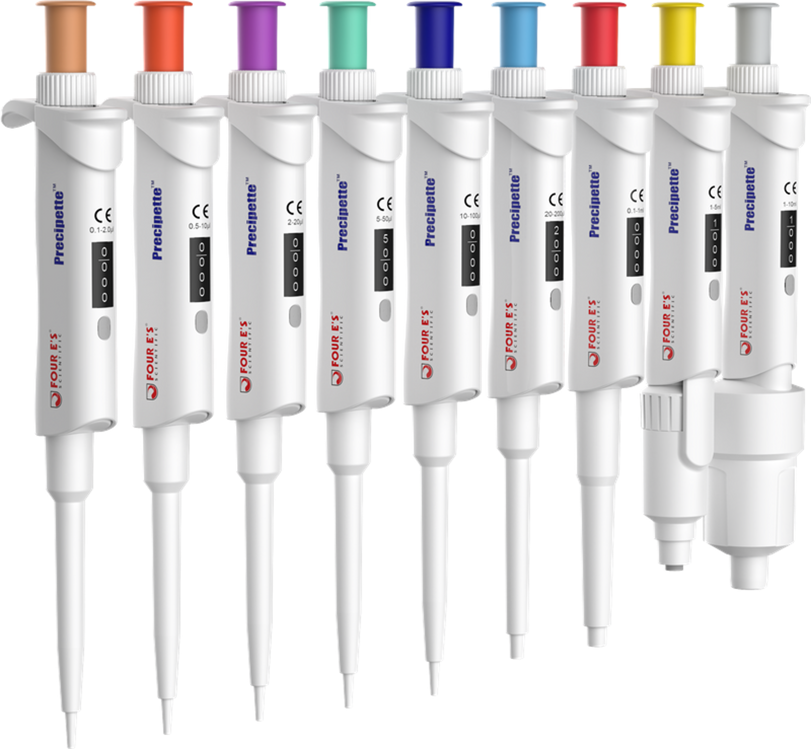

# Bill of Materials

## 0. Key Items

  <table id="key-items-table">
    <thead>
      <tr>
        <th style="width: 80px;">Status</th>
        <th>Item</th>
        <th>Link</th>
        <th>Need</th>
      </tr>
    </thead>
    <tbody id="key-items-body">
      <tr>
        <td colspan="4" style="text-align: center; color: #888;">Loading key items...</td>
      </tr>
    </tbody>
  </table>

### 0.1. [3D Printer](3D_printer.md)
You should get a [Creality Ender-3 S1](https://www.creality.com/products/creality-ender-3-s1-3d-printer) printer (preferable) or a [Creality Ender-3 S1 Pro](https://www.creality.com/products/creality-ender-3-s1-pro-fdm-3d-printer).

If you are unable to get access to either of these, refer to [choosing your printer](3D_printer.md)

*Figure 2: Preferred external layout maximizing clear movement area.*

### 0.2. Pipette

Heimdall is designed to use [Precipette™ Pipettes](https://www.4esci.com/Precipette-Pipettes-Single-channel-Adjustable-Volume-Pipette-pd47194942.html?srsltid=AfmBOoqAO3kqhTNZNMEfX73jpDfjbU-w6qV1anIF-a96RKfOx6sGQAOJ).

It is highly recommended to source this exact model to guarantee compatibility with the 3D-printed mounts and drive gears. If you must use an alternative pipette, ensure it meets the following criteria:

* **Front-Facing Volume Display:** The digital volume adjustment window must face directly forward to remain visible once mounted.
* **Front-Facing Tip Ejection:** The mechanical tip ejection mechanism must trigger from the front to properly interface with the automated tip disposal system.

## 1. Electronics

  <table id="electronics-table">
    <thead>
      <tr>
        <th style="width: 80px;">Status</th>
        <th>Item</th>
        <th>Link</th>
        <th>Need</th>
      </tr>
    </thead>
    <tbody id="electronics-body">
      <tr>
        <td colspan="4" style="text-align: center; color: #888;">Loading electronics...</td>
      </tr>
    </tbody>
  </table>

## 2. [Hardware](hardware.md)

  <table id="hardware-table">
    <thead>
      <tr>
        <th style="width: 80px;">Status</th>
        <th>Item</th>
        <th>Link</th>
        <th>Need</th>
      </tr>
    </thead>
    <tbody id="hardware-body">
      <tr>
        <td colspan="4" style="text-align: center; color: #888;">Loading hardware...</td>
      </tr>
    </tbody>
  </table>

## 3. Tools

  <table id="tools-table">
    <thead>
      <tr>
        <th style="width: 80px;">Status</th>
        <th>Item</th>
        <th>Link</th>
        <th>Need</th>
      </tr>
    </thead>
    <tbody id="tools-body">
      <tr>
        <td colspan="4" style="text-align: center; color: #888;">Loading tools...</td>
      </tr>
    </tbody>
  </table>

