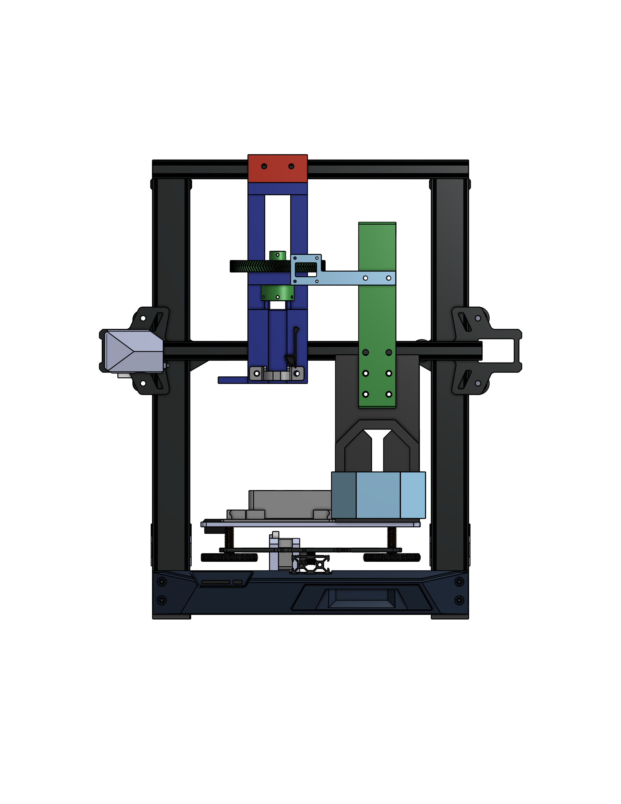

# Welcome to the HEIMDALL Wiki!
Meet HEIMDALL: The Sub-$500 Open-Source Liquid Handler

{ width="500" }

High-end lab automation shouldn't require a high-end budget. Built by repurposing the robust framework of a commercial 3D printer, HEIMDALL is a fully open-source liquid handling robot that you can build yourself for under $500. Designed for accessibility, flexibility, and endless community customization, HEIMDALL democratizes automated pipetting for researchers, makers, and labs everywhere.

## Quick links
* [Getting started](setup.md)
* [Bill of Materials](hardware/bill_of_materials.md)
* [Git Repository](software/git.md)