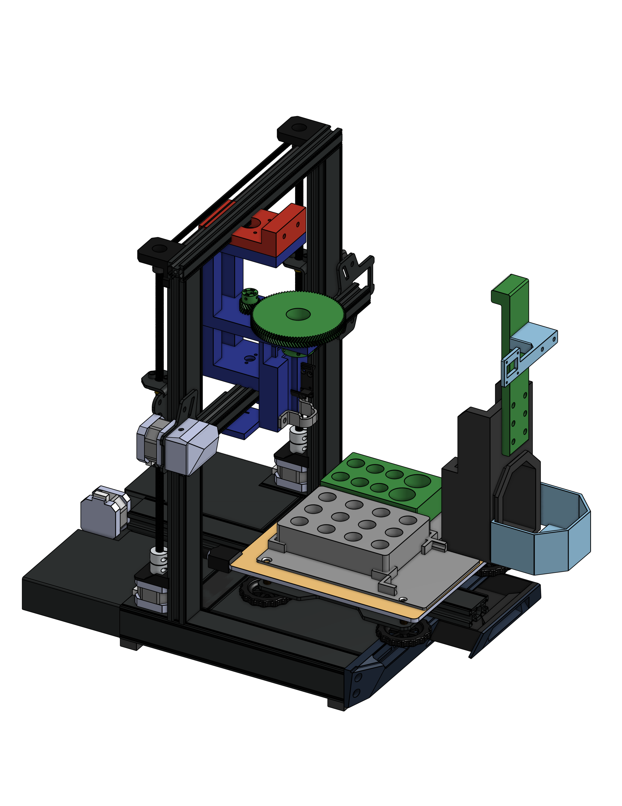

# Welcome to the HEIMDALL Wiki!
Meet HEIMDALL: The Sub-$500 Open-Source Liquid Handler.

High-end lab automation shouldn't require a high-end budget. Built by repurposing the robust framework of a commercial 3D printer, HEIMDALL is a fully open-source liquid handling robot that you can build yourself for under $500. Designed for accessibility, flexibility, and endless community customization, HEIMDALL democratizes automated pipetting for researchers, makers, and labs everywhere.

This wiki provides a comprehensive, step-by-step guide to building, wiring, programming, and calibrating your own HEIMDALL liquid handling robot.
 

