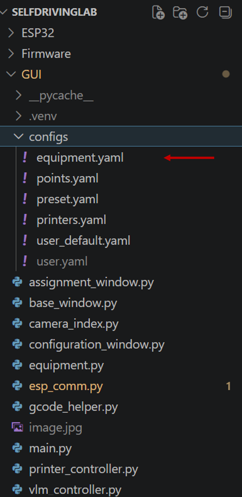
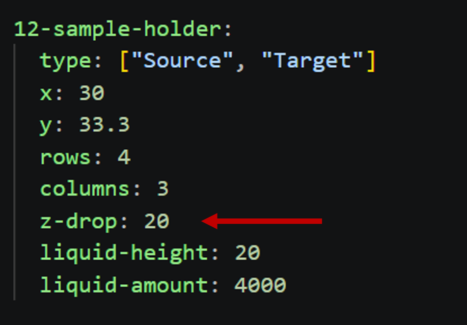
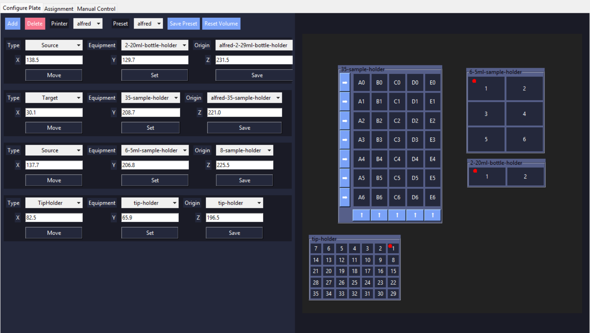
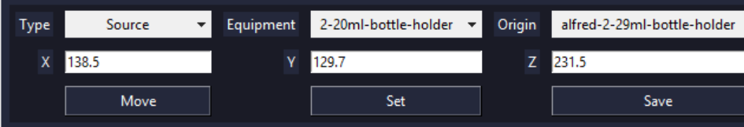
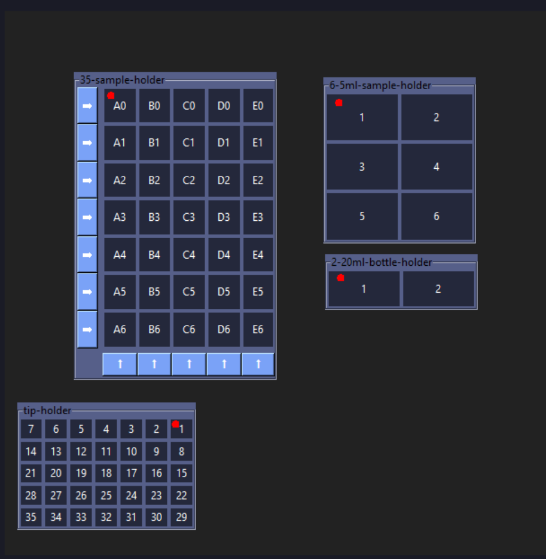
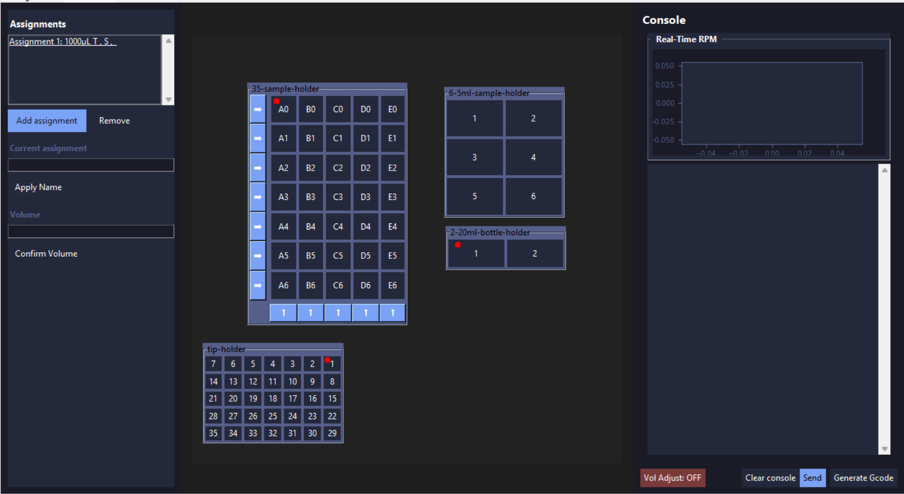
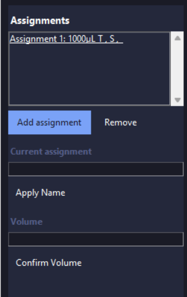
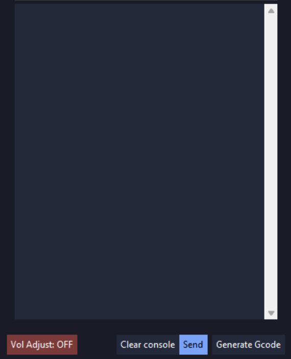

# Guide to our GUI

Our GUI provides a visual interface for configuring the liquid handling system and creating automated workflows.

## Features

- Easily customizable plate, labware, and handler configurations
- Visual deck layout and equipment management
- Define and execute liquid handling operations
- Configuration-based setup for adapting to different hardware arrangements
- Support for custom workflows and automation sequences

The GUI source code is located in the GUI folder of the repository, while all system and equipment configurations are stored in the configs folder. This is so hardware setups and workflows can be modified without changing the core application code.

## 0. Prerequisites

If you have not already done so, follow the instructions to [download the repository](git.md).

To run our GUI, you will need to have Python installed on your device, along with some packages.
### 0.1. Install Python

Install Python 3.10 or newer:

- https://www.python.org/downloads/

During installation (Windows), make sure to check:
- "Add Python to PATH"

Verify installation:

```bash
python --version
pip --version
```

### 0.2. Create a Virtual Environment

Navigate to within the `GUI` folder in your local repository, and run
```bash
python -m venv .venv
```
This creates a virtual environment, which keeps stuff needed to run our GUI seperate from the rest of the stuff on your.

Activate the virtual environment by running:

```bash
.venv\Scripts\activate
```

If you get a permission error while activating the environment, run:

```bash
Set-ExecutionPolicy -ExecutionPolicy RemoteSigned -Scope CurrentUser
```

Then rerun

```bash
.venv\Scripts\activate
```

### 0.3. Install dependancies

Upgrade pip:
```bash
pip install --upgrade pip
```
Install required packages:
```bash
pip install numpy scipy pyserial spatialmath-python google-generativeai python-dotenv opencv-python
```

### 0.4 Get a Gemini API key

[Generate an API key](https://www.google.com/aclk?sa=L&pf=1&ai=DChsSEwiEjOfn142VAxXmiWYCHQIUHEcYACICCAEQARoCc20&co=1&ase=2&gclid=CjwKCAjw6MPRBhBTEiwAd-7Mr2ZbTChhUKYpnTNHp_X28Ozr_jtnZicKrHvAJZqWRulg4AAOXcprthoCOzwQAvD_BwE&cid=CAASugHkaPTZP0jViqOWFle6ECBEyZSN7pHJ1vp9DAzYcEf4y-rOuvTi3OjLuHlly1xVg8amdNTbfB4iuSd1Q_fPFCThw-iOmVMGjVzKv62vXu35oTy8QfaMLNPAhCx9VxnHy0s-lFXIrnd8Qb3sauvhuPJYk7Z9ZRXa7mi7SokCm41UfhQZRtLtIsKd2UyD7OdjvhOoj8FxBKSpKaOaeMfv1kGGSOgfwbYFe_MQj2KB1Jit3xVxUmqBlR3hAKU&cce=2&category=acrcp_v1_32&sig=AOD64_3VQgsLZEOCMuMqcpeJk-h72p3b5w&q&nis=4&adurl=https://ai.google.dev/gemini-api/docs/api-key?utm_source%3Dgoogle%26utm_medium%3Dcpc%26utm_campaign%3DCloud-SS-DR-AIS-FY26-global-gsem-1713578%26utm_content%3Dtext-ad%26utm_term%3DKW_gemini%2520api%2520key%26gad_source%3D1%26gad_campaignid%3D23417416052%26gbraid%3D0AAAAACn9t67MEGb9dGMcPK0_kesYeoFk0%26gclid%3DCjwKCAjw6MPRBhBTEiwAd-7Mr2ZbTChhUKYpnTNHp_X28Ozr_jtnZicKrHvAJZqWRulg4AAOXcprthoCOzwQAvD_BwE&ved=2ahUKEwizxODn142VAxWda2wGHRh6OQQQqyQoAHoECBYQHA). 

Create a .env file within the ```GUI``` folder.


In the new file, paste:
```
GEMINI_API_KEY=<your key here>
```
## 1. Setting Up a New Handler


Open `GUI/configs/printers.yaml` using a code editor or text editor.


This file contains the configuration settings for each handler.


### 1.1. Setting Volume Limits

Set `min_vol` and `max_vol` to the minimum and maximum volumes (in μL) supported by your pipette, respectively.

### 1.2. Setting Decimal Position

Set `decimal_position` to match the location of the decimal point on the pipette display.

Examples:

* If the display shows `1000` for **100.0 μL**, set `decimal_position` to `1`.
* If the display shows `1000` for **1000 μL**, set `decimal_position` to `0`.

### 1.3. Callibrating volume adjust position

[Run the GUI](#20-running-the-gui) and [connect to the printer](#21-connecting-to-esp-printer-and-camera).

Go to the [Manual Tab](#24-manual). Open your camera and use the [d-pad](#2411-movement-d-pad) to adjust the pipette until you can clearly see the volume readout in the center of the camera feed. Use the [Set button](#2412-position-control) to get this position, and edit vol_adjust_position to this coordinate.

### 1.4. Callibrating tip disposal sequence
This is what the tip disposal sequence looks like.


In order to callibrate the tip disposal sequence, using the dpad, move your pipette until it is in the tip ejection position.


Then, execute the tip ejection in reverse, starting by moving it down by dispose_actuate_z. You should change any of the values to avoid collision between your pipette and the tip disposal chamber. After finishing the sequence, use the [Set button](#2412-position-control) to get this position, and edit dispose_start to this coordinate.

> **IMPORTANT:** Any time you edit the `printer.yaml` configuration file, you must close and re-open the GUI for the changes to take effect.

### 1.5. Callibrating equipment


We highly recommend 3D printing both the **8-sample holder** and the **12-sample holder**, as these serve as ideal standardized tools for calibrating your handler.


1. Navigate to the [Configure Plate](#222-equipment-configuration-menu) tab and click the **Add** button.
2. Select your corresponding **Type** and **Model**, and ensure **(new)** is selected in the origin dropdown menu.
3. Go to the [**Manual**](#24-manual) tab.
4. [**Home**](#242-homing) the liquid handler (all axes).
5. Use the [D-pad](#2411-movement-d-pad) to move the pipette directly over the equipment's physical **Anchor Position**. Ensure the tip is perfectly centered over the vessel and lowered to a depth *just below the surface level* of the liquid.
6. Open your local configuration file at `GUI/configs/equipment.yaml`, locate your specific equipment model, and find its defined `z-drop` value.

     

7. Return to the manual controls and **raise** the pipette upward by that exact `z-drop` value.
8. Switch back to the **Configure Plate** tab, and on the active equipment menu, click **Set** to capture the coordinates, then click **Save**.

Repeat 1-8 for any other equipment.

### 1.7. Calibrating Pipette Dispense Volume

The liquid handler controls volume delivery using a linear actuator that runs for a calculated duration of time. Because friction, tubing diameter, and actuator speed vary by setup, you must calibrate the relationship between actuator runtime and actual volume dispensed. 

This is achieved by running a test protocol, weighing the dispensed liquid on a precision scale, and adjusting the software timing factor accordingly.

1. **Prepare the Test:** Fill a source vessel with deionised water. Weigh a few (we did six) empty, clean target vessels. (recommended using a scale that can measure up to .1mg)
2. **Execute a Test Run:** Place target vessels into holder. Use the GUI to program the handler to dispense a set target volume into the target vessels.
3. **Weigh the Yield:** Record the weight of the dispensed liquid in mg, and divide by 1.0033 to get volume in micro litres.
4. **Calculate and Adjust:** * If the weight is **lower** than expected, your actuator needs to run longer. If the weight is **higher** than expected, the actuator needs to run for a shorter duration. Open printer.yaml and edit aspiration_actuation_time.

    > **IMPORTANT:** Any time you edit the `printer.yaml` configuration file, you must close and re-open the GUI for the changes to take effect.

5. **Repeat:** Repeat this process until the physical weight consistently matches your target UI volume entry within your laboratory's acceptable margin of error.

Congratulations! Your HEIMDALL is ready to go!


## 2. Basic operation

### 2.0. Running the GUI

To run the GUI, open a command prompt in the GUI folder and run:

```bash
.venv/Scripts/activate
python main.py
```

### 2.1. Connecting to ESP, printer and camera

It is highly recommended to use **Device Manager** to identify the correct ports for the ESP and printer. You can do this by unplugging and replugging the USB devices and observing which COM ports appear and disappear.

Once identified, set the respective ports in the connection bar.

If the port does not appear in the dropdown menu, click **Refresh Ports**. If it still does not appear, check Device Manager again to confirm whether the device is being detected.


After selecting the correct ports, press **Connect** and wait. (Be patient — this may take a few moments.)

### 2.2. Configure Plate

Your GUI should initialise on this tab. To access this tab, click on the "Configure Plate" button at the top of your screen. This is where you define the equipment layout on your plate.



#### 2.2.1. Equipment Management Bar


##### 2.2.1.1. Add Equipment
Opens the **Equipment Configuration Menu** to add a new piece of equipment to your current plate layout.

##### 2.2.1.2. Delete Equipment
Removes the selected equipment from your plate. 

> **How to use:** Click the specific equipment's Configuration Menu first, then click this button to delete it.

##### 2.2.1.3. Printer Selection (Dropdown)
Switches between active liquid handler profiles defined in `printer.yaml`. Use this if your system controls multiple liquid handling units.

##### 2.2.1.4. Preset Selection (Dropdown)
Loads a **Preset** (a saved layout of equipment and their assigned origin points) so you do not have to rebuild your plate layout from scratch.

##### 2.2.1.5. Save Preset
Saves the current plate layout. 

* **Overwriting:** If an existing preset is selected, clicking this overwrites it.
* **Creating New:** If **(new)** is selected, you will be prompted to enter a name for the new preset.

##### 2.2.1.6. Reset Volume
The liquid handler lowers the pipette tip into the bottle based on the calculated amount of liquid left in hte bottle. It will usually assume a bottle is filled to capacity unless otherwise defined.

* **Adjust Volume:** Click a specific source bottle to manually enter its remaining volume (underestimating is recommended).
* **Reset Volume:** Click the **Reset Volume** button to reset all source volumes back to maximum capacity.

#### 2.2.2. Equipment Configuration Menu



This menu appears when a new piece of equipment is added. Each configured menu represents a physical item positioned on your plate layout. 

Every item requires three primary definitions: an **Equipment Type**, a specific **Equipment Model**, and an **Origin Point**.

##### 2.2.2.1. Equipment Type
Defines the functional role of the equipment. Select this based on your planned protocol operations:

* **Source:** The vessel where liquid is drawn or picked up from.
* **Target:** The vessel where liquid is dispensed.
* **TipHolder:** The rack where clean pipette tips are stored for pickup.

##### 2.2.2.2. Equipment Model
Selects the specific physical footprint or brand layout (e.g., *96-Well Plate*, *50mL Trough*) matching your hardware. This tells the system the exact dimensions, spacing, and depths of the vessels. 

> ⚠️ **Important:** Each configuration profile only supports **one uniform vessel type**. If you are using a physical rack or holder that contains a mix of different vessels (e.g., tubes with varying volumes, diameters, or starting heights), you must define them as separate equipment entries in the software for each distinct vessel type.

##### 2.2.2.3. Origin
Defines the physical starting coordinate (X, Y, Z) for the equipment on the liquid handler deck. The system uses this reference point to automatically calculate the positions of all other vessels or positions on that item.

Only one specific vessel acts as the **Anchor Position** (origin). When you select an **Equipment Model**, a visual map of the layout will appear on the right side of the screen with a red dot marking this Anchor Position. 

> **Important:** When physically calibrating and saving the equipment's origin on the deck, you must align the liquid handler's pipette tip precisely with the specific bottle, tube, or well marked by the red dot.

##### 2.2.2.4. Move
Commands the liquid handler to navigate directly to the **Anchor Position** of the selected equipment. 

> ⚠️ **Warning:** Always home the liquid handler before using this function. If the machine is not homed, coordinates will be inaccurate, risking a collision with the edge of the workspace or hardware. Use this button primarily to verify that your calibrated origin is correct.

##### 2.2.2.5. Set
Queries the liquid handler for its current real-time coordinates and automatically populates the X, Y, and Z input fields. Use this tool after manually jogging the pipette tip precisely over the physical Anchor Position to instantly capture its coordinates.

##### 2.2.2.6. Save
Saves the currently entered coordinates to the system.

* **Overwriting:** If an existing origin point is selected, clicking this will overwrite it.
* **Creating New:** If **(new)** is selected, you will be prompted to enter a unique name to save the new origin point.

#### 2.2.3. Plate Layout



On the right side of the screen, a visual grid displays a live approximation of your physical plate layout. 

* **Collision Warning:** If you notice equipment grids overlapping or clipping into each other on the screen, immediately double-check that you have calibrated and saved your **Anchor Positions** correctly.
* **Source Volume Management:** This interactive map also serves as a shortcut for inventory tracking. You can click directly on any **Source** equipment vessel to open a pop-up menu and manually update its estimated remaining liquid volume.


### 2.3. Assignment Tab

Click the **Assignment** button at the top of the screen to access this tab. This interface is where you define and manage the exact fluid transfer routines your liquid handler will execute.



#### 2.3.0. What is an Assignment?
An **Assignment** is a single protocol instruction consisting of four components: a designated **Tip**, a **Source** vessel, one or more **Target** vessels, and a specified transfer **Volume**.

#### 2.3.1. Assignment Management



##### 2.3.1.1. Assignment Information and Selection
This pane lists your created routines using the format: `[Assignment Name] T: [Tip] S: [Source] T: [Targets]`.
* Click an assignment from the list to select it. All subsequent edits or configurations will apply strictly to this active selection.

##### 2.3.1.2. Assignment Adding and Deleting
* **Add:** Creates a new, blank assignment.
* **Delete:** Permanently removes the currently selected assignment from the queue.

##### 2.3.1.3. Assignment Name
To rename your selection, type a unique name into the text input field and click **Apply Name**.

##### 2.3.1.4. Assignment Volume
Enter your target transfer volume and click **Save Volume**. 
> ⚠️ **Error:** If the entered volume exceeds or falls below the physical capabilities of your installed pipette tip, the system will throw a validation error.


#### 2.3.2. Assignment Selection


To build the fluid pathway for your active assignment, click directly on the respective buttons to select the **Source**, **Tip**, and **Targets**.

#### 2.3.3. Assignment Execution



##### 2.3.3.1. Volume Adjustment Toggle
Toggles pipette volume adjustment on and off.

##### 2.3.3.2. Clear Console
Clears all log outputs, status messages, and history from the console display window.

##### 2.3.3.3. Generate G-code
Genenerates instructios (G-code) that controls the handler. The generated code will populate directly in the panel for your review.

##### 2.3.3.4. Send
Transmits the generated G-code script to the liquid handler to begin execution.

### 2.4. Manual

!!! warning
    BE VERY CAREFUL when using this tab, as you can easily ram your pipette into the surrounding equipment or the bed, which may cause severe damage (speaking from experience).

#### 2.4.1. Moving

There are two options for moving your pipette:

##### 2.4.1.1 Movement D-pad


The Movement D-pad provides manual control of the pipette, similar to a classic directional game controller. Each direction button moves the pipette along a selected axis (X, Y, or Z depending on the active mode), allowing for precise positioning within the workspace.

The movement distance per button press is defined by the **step size selection**, which sets the interval of each incremental move.

##### 2.4.1.2 Position Control

<div class="center" markdown>

</div>

!!! warning
    Before using these controls, you should [home](#242-homing) the machine to ensure coordinates are accurate.

The **Set** button reads the current position of the printer and updates the displayed coordinates accordingly.

The **Move** button commands the printer to move to the coordinates entered by the user.

#### 2.4.2. Homing


- **Home All**: Homes all axes in sequence (Z axis first, followed by X and Y).
- **Home X / Y / Z**: Homes the selected axes individually.
- **Motors On**: Engages the stepper motors, enabling controlled motion. Manual movement of the system is disabled while motors are active.
- **Motors Off**: Disengages the stepper motors, allowing the system to be moved manually.

Homing is the process of moving the liquid handler to a known reference position so that the system can establish a consistent and accurate coordinate frame. This ensures that all subsequent movements are based on a fixed, repeatable origin.

During a homing operation, the handler moves along each axis toward its respective limit switches. Once a limit switch is triggered, that position is defined as the axis reference (zero position), and the system resets its coordinate frame accordingly.

#### 2.4.3  Pipette Functions


!!! warning
    Be careful when using these controls. Pressing **Prime** or **Dispense** multiple times in quick succession may cause the actuator to extend excessively, which can potentially damage the pipette. Press once and wait for the system response before issuing another command.

- **Prime**: Prepares the pipette by filling the system and removing air bubbles.
- **Aspirate**: Draws liquid into the pipette.
- **Dispense**: Releases liquid from the pipette.


The volume controls allow adjustment of the target dispensing or aspirating volume.

- **Increase / Decrease Volume**: Adjusts the set volume in defined increments.
- **Adjust Volume**: Commands the system to calibrate or apply the selected volume setting.

Ensure that both the **camera** and **printer** are properly connected before starting volume adjustment, as the system relies on feedback from both components for accurate calibration.


## 3. Advanced operation

### 3.1. Setting Up New Equipment

To add a completely custom piece of equipment or rack that is not included by default, you must define its physical dimensions and layout parameters in the configuration files.

#### Step-by-Step Setup:

1. Open your configuration directory and locate the `equipment.yaml` file.
2. Scroll to the top of the file, copy the template block provided under the **Sample Equipment** comment, and paste it at the bottom of the file.
3. Update the parameters to match your custom hardware based on the definitions below:

| Parameter | Description |
| :--- | :--- |
| `x` | The physical distance (pitch) horizontally between the centers of adjacent vessels. |
| `y` | The physical distance (pitch) vertically between the centers of adjacent vessels. |
| `rows` | The total number of rows in the equipment grid. |
| `cols` | The total number of columns in the equipment grid. |
| `z-drop` | For Source and Target types: The vertical distance the pipette is lowered from the zero-clearance origin point to safely reach the fluid surface. For TipHolder types, distance lowered to retrieve tip. |
| `z-lift`| For TipHolder types: Distance to lift after getting tip to clear the tip holder.|
| `liquid-height` | The distance from the top surface of the liquid to the internal bottom of the vessel. *(Note: Always underestimate this value for safety).* |
| `liquid-amount` | The total volume capacity of the liquid inside the vessel. *(Note: Always underestimate this value to prevent liquid level miscalculations).* |
