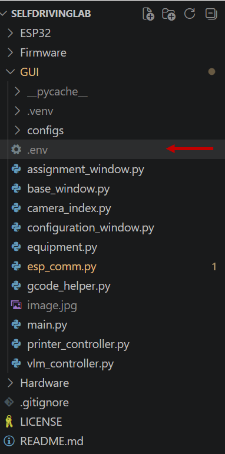
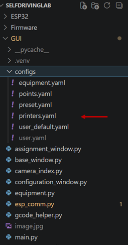
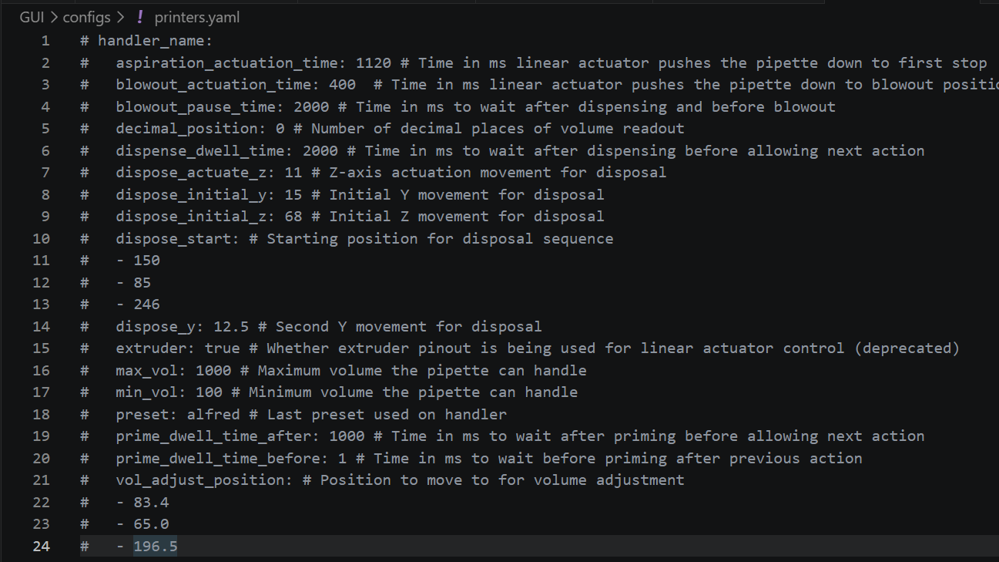
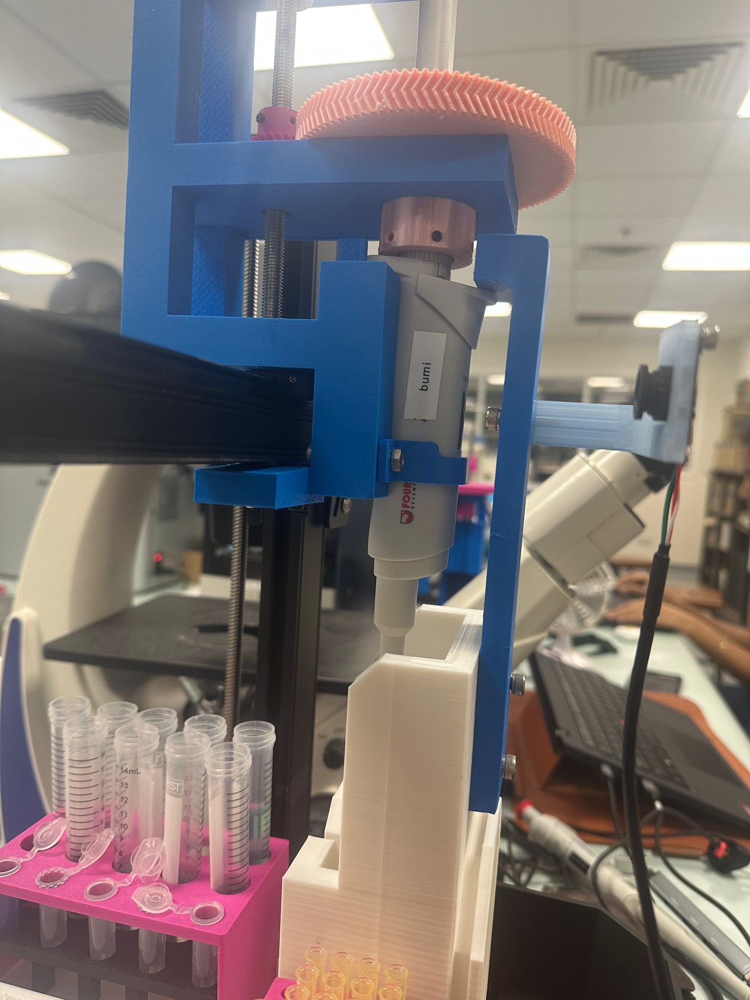
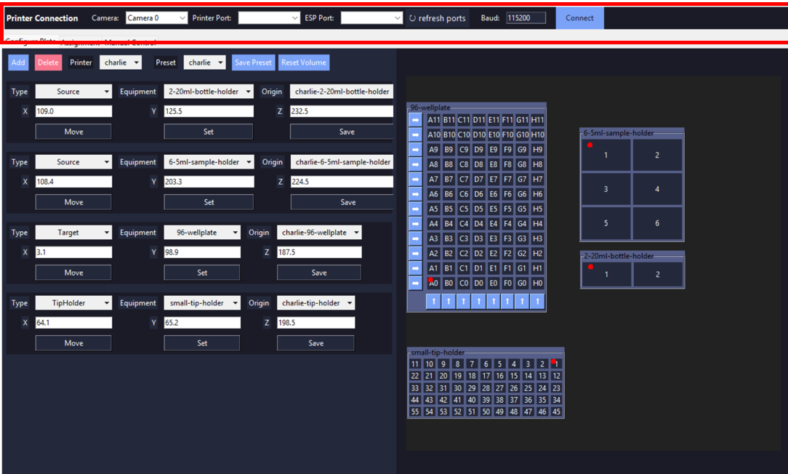
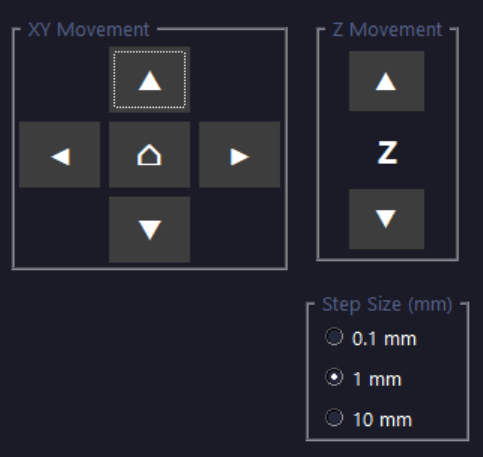
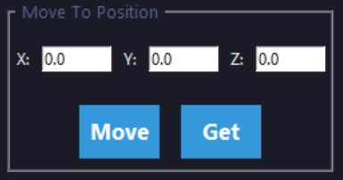
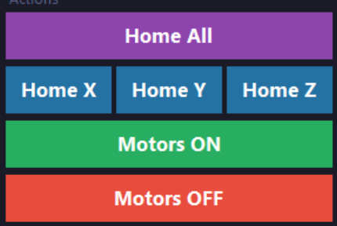
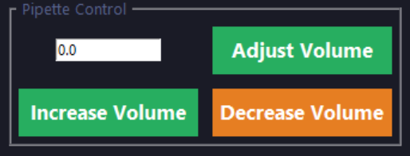

# Guide to our GUI

Our GUI provides a visual interface for configuring the liquid handling system and creating automated workflows.

## Features

- Easily customizable plate, labware, and handler configurations
- Visual deck layout and equipment management
- Define and execute liquid handling operations
- Configuration-based setup for adapting to different hardware arrangements
- Support for custom workflows and automation sequences

The GUI source code is located in the GUI folder of the repository, while all system and equipment configurations are stored in the configs folder. This is so hardware setups and workflows can be modified without changing the core application code.

## 0. Prerequisites

If you have not already done so, follow the instructions to [download the repository](git.md).

To run our GUI, you will need to have Python installed on your device, along with some packages.
### 0.1. Install Python

Install Python 3.10 or newer:

- https://www.python.org/downloads/

During installation (Windows), make sure to check:
- "Add Python to PATH"

Verify installation:

```bash
python --version
pip --version
```

### 0.2. Create a Virtual Environment

Navigate to within the `GUI` folder in your local repository, and run
```bash
python -m venv .venv
```
This creates a virtual environment, which keeps stuff needed to run our GUI seperate from the rest of the stuff on your.

Activate the virtual environment by running:

```bash
.venv\Scripts\activate
```

### 0.3. Install dependancies

Upgrade pip:
```bash
pip install --upgrade pip
```
Install required packages:
```bash
pip install numpy scipy pyserial spatialmath-python google-generativeai python-dotenv opencv-python
```

### 0.4 Get a Gemini API key

[Generate an API key](https://www.google.com/aclk?sa=L&pf=1&ai=DChsSEwiEjOfn142VAxXmiWYCHQIUHEcYACICCAEQARoCc20&co=1&ase=2&gclid=CjwKCAjw6MPRBhBTEiwAd-7Mr2ZbTChhUKYpnTNHp_X28Ozr_jtnZicKrHvAJZqWRulg4AAOXcprthoCOzwQAvD_BwE&cid=CAASugHkaPTZP0jViqOWFle6ECBEyZSN7pHJ1vp9DAzYcEf4y-rOuvTi3OjLuHlly1xVg8amdNTbfB4iuSd1Q_fPFCThw-iOmVMGjVzKv62vXu35oTy8QfaMLNPAhCx9VxnHy0s-lFXIrnd8Qb3sauvhuPJYk7Z9ZRXa7mi7SokCm41UfhQZRtLtIsKd2UyD7OdjvhOoj8FxBKSpKaOaeMfv1kGGSOgfwbYFe_MQj2KB1Jit3xVxUmqBlR3hAKU&cce=2&category=acrcp_v1_32&sig=AOD64_3VQgsLZEOCMuMqcpeJk-h72p3b5w&q&nis=4&adurl=https://ai.google.dev/gemini-api/docs/api-key?utm_source%3Dgoogle%26utm_medium%3Dcpc%26utm_campaign%3DCloud-SS-DR-AIS-FY26-global-gsem-1713578%26utm_content%3Dtext-ad%26utm_term%3DKW_gemini%2520api%2520key%26gad_source%3D1%26gad_campaignid%3D23417416052%26gbraid%3D0AAAAACn9t67MEGb9dGMcPK0_kesYeoFk0%26gclid%3DCjwKCAjw6MPRBhBTEiwAd-7Mr2ZbTChhUKYpnTNHp_X28Ozr_jtnZicKrHvAJZqWRulg4AAOXcprthoCOzwQAvD_BwE&ved=2ahUKEwizxODn142VAxWda2wGHRh6OQQQqyQoAHoECBYQHA). Create a .env file within the ```GUI folder.


In the new file, paste:
```
GEMINI_API_KEY=<your key here>
```
## 1. Setting Up a New Handler


Open `GUI/configs/printers.yaml` using a code editor or text editor.



This file contains the configuration settings for each handler.



### 1.1. Setting Volume Limits

Set `min_vol` and `max_vol` to the minimum and maximum volumes (in μL) supported by your pipette, respectively.

### 1.2. Setting Decimal Position

Set `decimal_position` to match the location of the decimal point on the pipette display.

Examples:

* If the display shows `1000` for **100.0 μL**, set `decimal_position` to `1`.
* If the display shows `1000` for **1000 μL**, set `decimal_position` to `0`.

### 1.4. Callibrating volume adjust position

[Run the GUI](#20-running-the-gui) and [connect to the printer](#21-connecting-to-esp-printer-and-camera).

Go to the [Manual Tab](#24-manual). Open your camera and use the [d-pad](#2411-movement-d-pad) to adjust the pipette until you can clearly see the volume readout in the center of the camera feed. Use the [Set button](#2412-position-control) to get this position, and edit vol_adjust_position to this coordinate.

### 1.5. Callibrating tip disposal sequence
This is what the tip disposal sequence looks like.


In order to callibrate the tip disposal sequence, using the dpad, move your pipette until it is in the tip ejection position.



Then, execute the tip ejection in reverse, starting by moving it down by dispose_actuate_z. You should change any of the values to avoid collision between your pipette and the tip disposal chamber. After finishing the sequence, use the [Set button](#2412-position-control) to get this position, and edit dispose_start to this coordinate.

### 1.6. Callibrating equipment

We would recommend printing the [8 sample holder]() and the [12 sample holder](), as these will be useful for callibrating your handler.

### 1.7. Callibrating the handler


## 2. Basic operation

### 2.0. Running the GUI

To run the GUI, open a command prompt in the GUI folder and run:

```bash
.venv/Scripts/activate
python main.py
```

### 2.1. Connecting to ESP, printer and camera

It is highly recommended to use **Device Manager** to identify the correct ports for the ESP and printer. You can do this by unplugging and replugging the USB devices and observing which COM ports appear and disappear.

Once identified, set the respective ports in the connection bar.

If the port does not appear in the dropdown menu, click **Refresh Ports**. If it still does not appear, check Device Manager again to confirm whether the device is being detected.



After selecting the correct ports, press **Connect** and wait. (Be patient — this may take a few moments.)

### 2.2. Configuration

### 2.3. Assignment

### 2.4. Manual

!!! warning
    BE VERY CAREFUL when using this tab, as you can easily ram your pipette into the surrounding equipment or the bed, which may cause severe damage (speaking from experience).

#### 2.4.1. Moving

There are two options for moving your pipette:

##### 2.4.1.1 Movement D-pad



The Movement D-pad provides manual control of the pipette, similar to a classic directional game controller. Each direction button moves the pipette along a selected axis (X, Y, or Z depending on the active mode), allowing for precise positioning within the workspace.

The movement distance per button press is defined by the **step size selection**, which sets the interval of each incremental move.

##### 2.4.1.2 Position Control

<div class="center" markdown>

</div>

!!! warning
    Before using these controls, you should [home](#242-homing) the machine to ensure coordinates are accurate.

The **Set** button reads the current position of the printer and updates the displayed coordinates accordingly.

The **Move** button commands the printer to move to the coordinates entered by the user.

#### 2.4.2. Homing



- **Home All**: Homes all axes in sequence (Z axis first, followed by X and Y).
- **Home X / Y / Z**: Homes the selected axes individually.
- **Motors On**: Engages the stepper motors, enabling controlled motion. Manual movement of the system is disabled while motors are active.
- **Motors Off**: Disengages the stepper motors, allowing the system to be moved manually.

Homing is the process of moving the liquid handler to a known reference position so that the system can establish a consistent and accurate coordinate frame. This ensures that all subsequent movements are based on a fixed, repeatable origin.

During a homing operation, the handler moves along each axis toward its respective limit switches. Once a limit switch is triggered, that position is defined as the axis reference (zero position), and the system resets its coordinate frame accordingly.

#### 2.4.3  Pipette Functions


!!! warning
    Be careful when using these controls. Pressing **Prime** or **Dispense** multiple times in quick succession may cause the actuator to extend excessively, which can potentially damage the pipette. Press once and wait for the system response before issuing another command.

- **Prime**: Prepares the pipette by filling the system and removing air bubbles.
- **Aspirate**: Draws liquid into the pipette.
- **Dispense**: Releases liquid from the pipette.



The volume controls allow adjustment of the target dispensing or aspirating volume.

- **Increase / Decrease Volume**: Adjusts the set volume in defined increments.
- **Adjust Volume**: Commands the system to calibrate or apply the selected volume setting.

Ensure that both the **camera** and **printer** are properly connected before starting volume adjustment, as the system relies on feedback from both components for accurate calibration.


## Advanced operation

### Setting up new equipment
