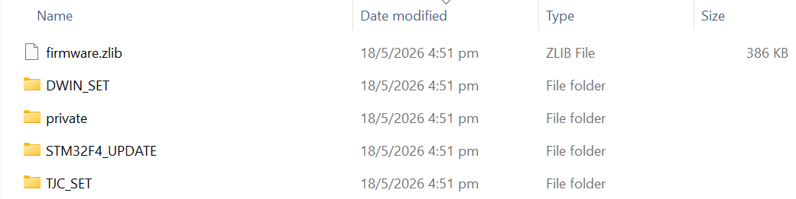
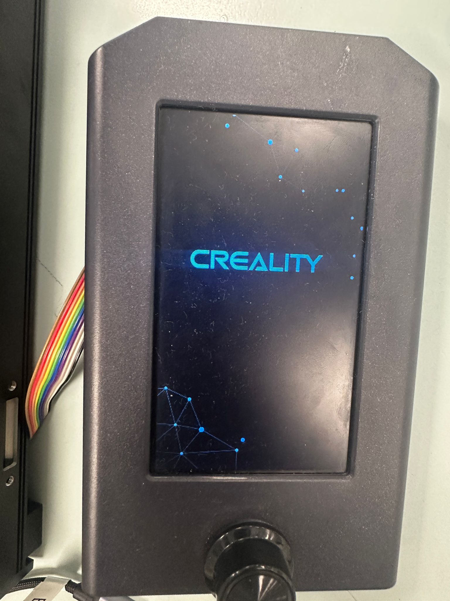
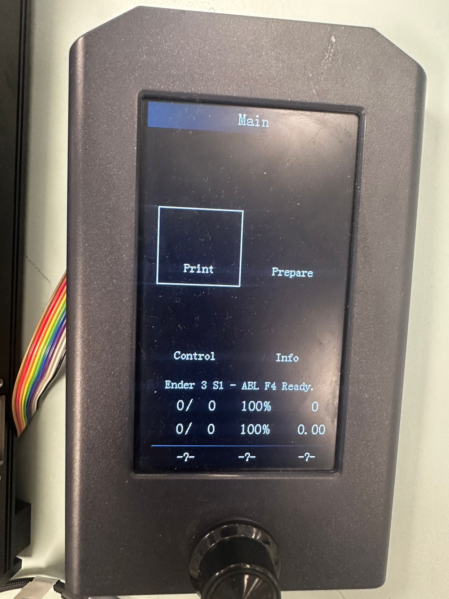
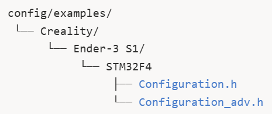
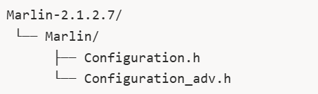
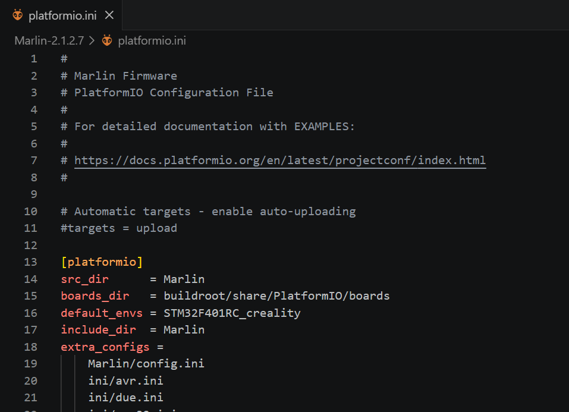

# Guide to compiling your own custom Marlin Firmware 
Compiling custom Marlin firmware is essential for our liquid handling system as the stock Ender 3 S1 printers are hardcoded to use the BR Touch sensor to probe the print bed to define the Z-min. 

Since we have customized our printer 3D printer to perform Z-max homing due to design constraints of the customized 3D bed plates, editing the firmware's directional and endstop settings are needed. 

## Settings changed

- Z Homing direction 
- Endstop pin assignment
- Software travel limits
- Changing Z bump when homing
- Other settings to ensure a smooth compilation of the Marlin Firmware

The firmware is a `.bin` file in the Firmware folder of the repository. This contains the machine-readable code that the Ender 3 S1 understands.

## 0. Flashing firmware on your Ender 3 S1 with STM32F4 chip

If you have not already done so, follow the instructions to [download the repository](git.md).

To flash the firmware on your printer's SD card, you will need the [Firmware folder](https://github.com/selfdrivinglabsntu/SelfDrivingLab/tree/main/Firmware) of the respository. 

### 0.1. Steps for flashing firmware
#### 0.1.1. Formatting the SD card 
- Set the file system to FAT32
- Set the allocation unit size to 4096
- 8GB SD card that came with the printer are most reliable, but anything less than 32 GB should work

#### 0.1.2. Copy the contents of the firmware folder to your formatted SD card
- The folders/file private, `DWIN_SET`, `TJC_SET`, and `firmware.zlib` are for updating the firmware display. 
- `STM32F4_UPDATE` folder contains your custom firmware file `firmware-2ndApril2_4.bin`  

{ .img-center .img-full }
Figure 1. Files/Folders to copy and paste in the root folder of formatted SD card.
{.center-p}

#### 0.1.3. Flashing your SD card
- Turn off your printer. Wait 20 seconds to power cycle your printer.
- While your printer is off, insert your SD card into the slot. 
- Turn the printer on. You will see the creality loading screen briefly while the board updates.  

{.img-center .img-sm}
Figure 2. Creality loading screen 
{.center-p}

- Once you see the main menu, the code has successfully flashed. The main menu is for visual aid only; it is not functional.

{.img-center .img-sm}
Figure 3. Main Menu
{.center-p}

- Turn off the power again for 20 seconds, remove the SD card, and turn on to start using your 3D printer.  
    
> **NOTE:** DO NOT INSERT YOUR SD CARD WHEN YOUR PRINTER IS TURING ON. IT CAN CAUSE THE BOOTLOADER TO HANG. ALWAYS MAKE SURE PRINTER IS OFF BEFORE INSERTING THESD CARD.

### 0.2. Troubleshooting

Flashing custom firmware on an Ender 3 S1 can sometimes be tricky. Here are somes specific requirements and common issues to be aware of.

1. **STM32F4_UPDATE folder:** If you are only updating the mainboard and not the display of your printer you can technicaly just flash the `.bin file`. However, from our experience it is much reliable to place your firmware in a folder named `STM32F4_UPDATE` before flashing. This is becuase the bootloader of the Ender 3 S1 with the STM32F4 chip, often only looks for the firmware in folder named exactly `STM32F4_UPDATE` (the name is case sensitive).

2. **Firmware file naming:**  The bootloader can be picky about the filename. The printer will often ignore a `.bin file` if it has the exact same name as the last one it flashed. Rename your file to something simple and unique, like `firmware123.bin or f1.bin`, before flashing again.

3. **Display screen stuck on splash screen/loading page or blank:** If your display screen is stuck on the loading page or is showing a blank screen for more than 2 mins, it could mean several things:
    1. **Firmware flashed properly but the screen is not compatible.** You can check this by conecting your printer to your computer and try operating the printer through pronterface. If you send the M119 command and see "z_max: open" it means that your firmware flashed properly.    
    
        You will have to update your screen again seprately.

    2. **Boatloader Hang:**
        1. Power-cycle your printer for a 1 minute and try flashing the firmware again.
        2. If the above doesn't work, download the [Official Creality firmware](https://www.creality.com/download/creality-ender-3-s1-3d-printer) and flash it. Sometimes the bootloader needs to be "primed" by an official Creality firmware before it will accept a custom one.

4. **Firmware not flashing:**
    1. Ensure that your chip is `STM32F4` and not `STM32F1`. You can verify this by checking which chip version is written on the mainboard.
    2. Please make sure that your SD card is formatted properly. 
## 1. Flashing firmware on any other printer

### 1.1. Compiling Custom Marlin 
#### 1.1.1. Prerequisites
Install the following:

- **Visual Studio Code**
    - Insert link

- **PlatformIO Extension**  
    1. Open VS Code  
    2. Go to Extensions   (Ctrl+Shift+V)
    3. Search for **PlatformIO IDE**  
    4. Install it 

#### 1.1.2.Download Marlin Source Code
Visit and download [Marlin-2.1.2.7 source code ](https://marlinfw.org/meta/download/).  
Extract the folder.

#### 1.1.3. Obtain the Example Configuration Files 
Many boards and printers already have tested configurations.
Visit and download the [configuration files](https://github.com/MarlinFirmware/Configurations/tree/release-2.1.2.7).

Locate the configuration files for your printer and firmware version.

{ .img-center .img-md } 
Figure 4. Location of configuration files
{.center-p}

Copy configuration.h and configuration_adv.h from the example files into your main Marlin folder of the source code.

{ .img-center .img-md } 
Figure 5. Location of configuration files
{.center-p}

Replace the existing files.

#### 1.1.4. Editing the code
Most of the customization occurs in `Marlin/Configuration.h` and `Marlin/Configuration_adv.h`

1. Disable the BL Touch sensor
2. Define Z_Max endstop switch
3. Set Z_max pos to 250
4. Z_max direction
5. Bump 
6. Other changes

>**Note:** You might not need to make the PID control changes for your compilation. But for us, without incorporating these changes we could not successfully compile software.

#### 1.1.5 Compiling the firmware
1. Open platform.ini
2. locate `default_envs = mega2560` and change it to your board environment.

Figure 6. The default_envs is changed from mega250 to STM32F401RC_creality, which is the build enviornment for Ender 3 S1 STM32F4 chip. 
{.center-p}

### 1.2. The correct SD card
Not all printers utilize the standard SD card for flashing the firmware. You might need to use a micro sd card and format it accordingly to flash your code.

For example, another printer that we modified was a Ender 3 V2 Neo for which the firmware was flashed using a micro sd card by simply placing the `.bin` file in the root folder. 

### 1.3. Flashing the Firmware
Follow steps [0.1.3. Flashing you SD Card](#013-flashing-your-sd-card).

## 2. Testing for successfull Firmware upload
### 2.1. Check z_max z-limit using pronterface or GUI
Open up pronterface send the M119 command. Do you see the Z_MAX instead of the Z_MIN switch. 

### 2.2. Open pronterface or GUI 
Home the Z-axis. If the gantry moves upwards and stops successfully when the z-limit switch is triggered (you can either [mount the z-limit switch]() or simply click it to test before mounting it), you have successfully flashed the firmware. :) 

