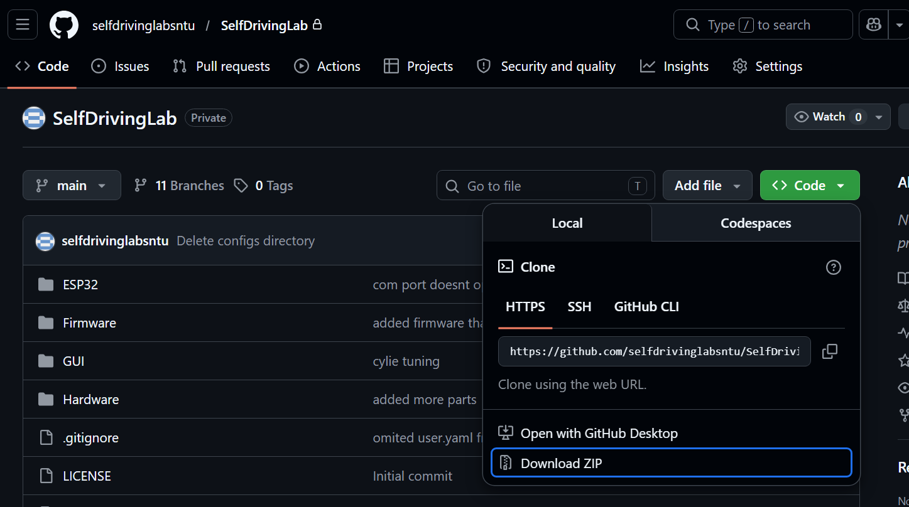

# Getting the Repository

Our [GitHub Repository](https://github.com/selfdrivinglabsntu/SelfDrivingLab) contains everything you need to build and run your HEIMDALL system, including 3D-printable part files and the interface software.

Choose one of the two options below to get the files, depending on your comfort level with Git:

## Option 1: Download zip file (Easiest)

Go to the [reposittory](https://github.com/selfdrivinglabsntu/SelfDrivingLab), click on the green Code button and click "Download ZIP"

Unzip the downloaded folder and you are good to go!



## Option 2: Clone repository (Recommended for developers)

1. Go to the [GitHub Repository](https://github.com/selfdrivinglabsntu/SelfDrivingLab).
2. Click the green **Code** button in the top right corner.
3. Under the **HTTPS** tab, copy the repository URL.
4. Open your terminal or command prompt, navigate to where you want to save the project, and run:

   ```
   git clone <copied link>
   ```